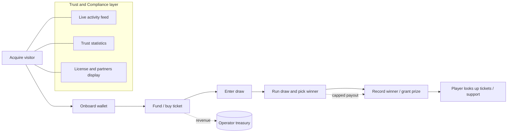
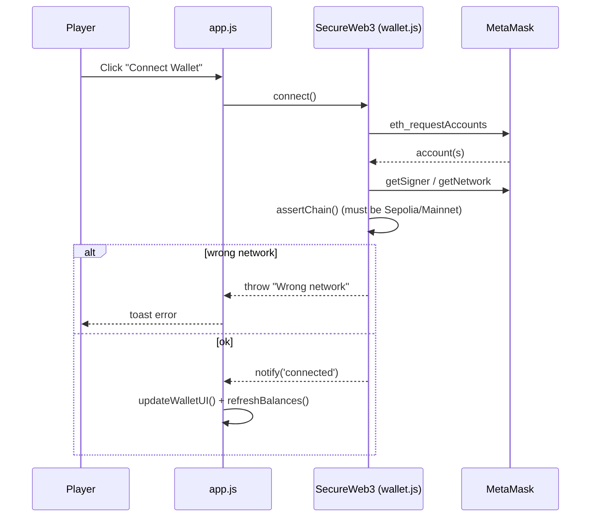
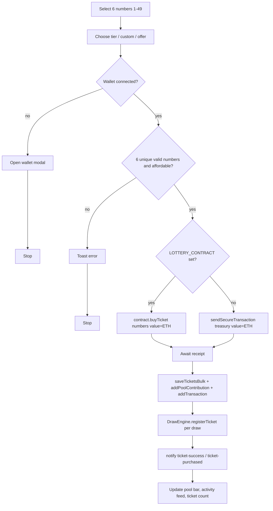
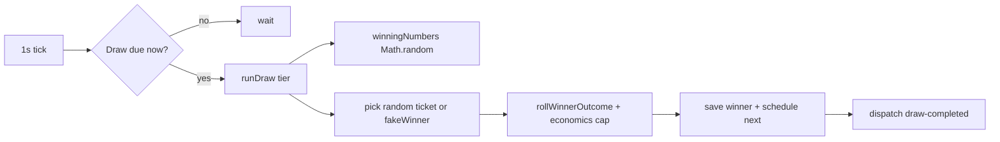
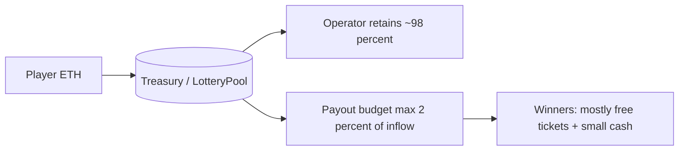

# NeonDraw — Business Process Documentation

> Scope: This document describes the **business processes** of the NeonDraw crypto‑lottery web application **as currently implemented in code** (`index.html`, `js/*.js`, `contracts/LotteryPool.sol`). It is descriptive, not aspirational — where a step is simulated / local‑only rather than a real on‑chain action, it is called out explicitly, because that distinction is material to the business.

---

## 1. Business overview

NeonDraw is a **B2C on‑chain crypto lottery**. Players connect a Web3 wallet, pick 6 numbers (1–49), pay in ETH, and are entered into scheduled draws (daily / weekly / monthly / quarterly) with advertised jackpots. Revenue is collected to an operator **treasury address** (or an optional `LotteryPool` escrow contract). The product is monetized on a **house‑edge / operator‑retention** model.

| Attribute | Value (from code) |
|-----------|-------------------|
| Product type | Crypto lottery + casino shell (games UI unwired) |
| Payment asset | ETH (via MetaMask / EIP‑1193) |
| Networks | Sepolia testnet (`11155111`), Ethereum Mainnet (`1`) — `js/wallet.js` |
| Ticket pricing | `$1` base + tiers `$1/$5/$10/$50/$100/$300/$500` + custom (USD→ETH @ `$3200/ETH`) |
| Draw tiers | Daily, Weekly, Monthly, Quarterly — `js/draw-engine.js` |
| Revenue capture | ETH → `TREASURY_ADDRESS` or `LotteryPool.buyTicket()` |
| Economic model | `OPERATOR_RETAIN_RATIO = 0.98`; player payouts capped at `2%` of inflow (`GLOBAL_PAYOUT_CAP_RATIO`) — `js/draw-engine.js` |

---

## 2. Actors & roles

| Actor | Description |
|-------|-------------|
| **Visitor / Player** | End user; browses, connects wallet, buys tickets, looks up entries. |
| **Operator (house)** | Owns the treasury wallet / `LotteryPool` contract; retains net revenue; runs the site. |
| **Wallet provider** | MetaMask / EIP‑1193 provider that signs and broadcasts transactions. |
| **Blockchain** | Ethereum (Sepolia/Mainnet) — settles deposits and ticket payments. |
| **Draw engine (system)** | Client‑side scheduler that runs draws, selects winners, and records history. |
| **Activity/Trust engine (system)** | Client‑side simulators that generate live‑feed volume and trust statistics. |

---

## 3. Process map (value chain)

**Core revenue process** = P4 (Buy ticket). All other processes exist to drive, support, or settle it.

---

## 4. Detailed business processes

### P1 — Visitor acquisition & landing

**Goal:** convert an anonymous visitor into an engaged, wallet‑ready player.

**Trigger:** page load of `index.html`.

**Steps (code):**
1. Scripts load in order (ethers → icons → wallet → draw‑engine → activity‑simulator → lottery → partners → license → ticket‑lookup → trust‑display → `app.js`).
2. `app.js` orchestrates init: `LotteryApp.init()`, `DrawEngine.init()`, `ActivitySimulator.init()`, `PartnerNetwork.init()`, `LicenseDisplay.init()`, `TicketLookup.init()`, `TrustDisplay.init()`.
3. Engagement/trust engines auto‑run: countdown tick (1 s), live ticker (fake purchases every 5–14 s), live "winner" injections (every 90–150 s), trust stats refresh (12 s), seeded winner history (18 fabricated entries on first visit).
4. `wallet.tryAutoConnect()` silently reconnects a previously‑authorized wallet.

**Output:** rendered lottery UI with (partly fabricated) social proof designed to encourage a purchase.

---

### P2 — Wallet onboarding (connect)

**Goal:** establish an authenticated Web3 session.

**Notes:** `chainChanged` → full page reload; `accountsChanged` → update/disconnect. Auto‑connect uses `eth_accounts` and the same validation.

---

### P3 — Deposit funds (real on‑chain)

**Goal:** move ETH from the player wallet to the operator treasury; credit a local "casino balance".

**Steps (`SecureWeb3.deposit`):**
1. `sendSecureTransaction(TREASURY_ADDRESS, amount)` → `assertChain()`, `rateLimit()` (8 s cooldown), `validateAmount()` (0.001–2 ETH), balance check.
2. `signer.sendTransaction({ to: treasury, value })`; wait for `receipt.status === 1`.
3. Credit `starbitz_balances[address]` (localStorage) and log tx (`type: 'deposit'`).

**Boundary:** the ETH transfer is **real**; the "casino balance" it credits is **local‑only** and (currently) **not used to buy tickets**. USDT/BTC deposit buttons are **non‑functional**.

---

### P4 — Buy lottery ticket (core revenue process)

**Goal:** collect payment and enter the player into a draw.

**Payment path:** `LOTTERY_CONTRACT || TREASURY_ADDRESS`. Bulk buys send **one** ETH payment but mint `quantity` local ticket records. Promotions/offers only adjust the `selection` (quantity, unit price) — same payment path.

**Free‑ticket variant (`redeemFreeTicket`)**: no chain tx; decrements `starbitz_free_tickets`, stores a ticket with `hash: null, free: true`, and registers it to the draw.

**Boundary:** the ETH payment is **real** (once treasury/contract configured); ticket records, pool totals, and draw registration are **local‑only**.

---

### P5 — Draw execution & winner selection

**Goal:** run scheduled draws and produce winners/history.

**Two parallel pipelines:**

- **A. Scheduled draws** (`source: 'scheduled'`): every 1 s, `checkDraws()` compares `nextDraw` to now; when due, `runDraw(tier)` → `winningNumbers()` (client `Math.random()` 6/49) → pick a random real ticket from `starbitz_tickets_by_draw` (or a `fakeWinner()` if none) → `rollWinnerOutcome()` (weighted: ~38% free ticket, ~50% small cash, ~9% medium, small % jackpot) → payout capped by economics → record to `starbitz_draw_winners` → schedule next draw.
- **B. Live winner feed** (`source: 'live'`): independent timer emits **always‑fake** winners every 90–150 s for social proof.

**Boundary:** randomness is **client‑side `Math.random()`** (no VRF); draw execution, winner choice, and prize accounting are **local‑only**. There is **no on‑chain prize transfer** to winners (free‑ticket credits excepted, which are also local).

---

### P6 — Withdrawal (simulated)

**Goal (as coded):** let a player "withdraw" their casino balance.

**Steps (`SecureWeb3.withdraw`):** validate amount/balance → `assertSafeAddressInput()` (blocks keys/seed phrases) → **`setTimeout(1200)`** → debit `starbitz_balances` → generate a **fake tx hash** (`ethers.randomBytes(32)`) → log tx with `status: 'demo'`.

**Boundary:** **fully simulated / local‑only.** No ETH leaves the treasury. ⚠️ Combined with P3/P4 (real deposits), this asymmetry is the single most important business/compliance risk and must be resolved before any real‑money launch (see §7).

---

### P7 — Ticket lookup & self‑service support

**Goal:** let a player review their entries.

**Steps (`TicketLookup.search`):** validate address → `getTicketsByAddress()` filters `starbitz_lottery_tickets` **on this device only** → render summary + per‑tx groups + Etherscan links.

**Boundary:** **not a global indexer** — only records created in the current browser are visible. Etherscan links use real tx hashes when purchases were real.

---

### P8 — Trust, compliance & partner display

| Component | Content | Data source |
|-----------|---------|-------------|
| Trust stats (`trust-display.js`) | "$2.85M paid out", "14,280 winners", "players online" | Inflated base constants + local winner sums + random jitter |
| Live activity (`activity-simulator.js`) | Global purchase/winner ticker | Fabricated events + this device's real purchases |
| License (`license.js`) | Curaçao GCB certificate | **Hardcoded** marketing text (no verification link) |
| Partners (`partners.js`) | Las Vegas casino logos | Static images (Wikimedia + local SVG), no affiliate links |

**Boundary:** trust/compliance/partner content is **presentational** and largely **fabricated or hardcoded**; treat as marketing assets, not verified facts.

---

## 5. Revenue & economics model

- **Inflow:** every paid ticket + deposit → treasury/contract.
- **Retention:** `OPERATOR_RETAIN_RATIO = 0.98`; `GLOBAL_PAYOUT_CAP_RATIO = 0.02` caps total player payouts at 2% of inflow (daily + lifetime caps in `starbitz_economics_state`).
- **Payout shape:** winner outcomes skew heavily to free tickets and small cash; advertised jackpots are **display targets**, not funded on‑chain pools.
- **Withdrawal by operator:** treasury wallet directly, or `LotteryPool.withdrawPool(to, amount)` (owner‑only; not exposed in the UI).
- **Promotions** (e.g. "5 for $4") are marketing framing — the player still pays the promo USD in ETH; bonus entries exist only as local records.

---

## 6. Real vs simulated — governance summary

| Real (on‑chain, once configured) | Simulated / local‑only |
|----------------------------------|-------------------------|
| Wallet connect & balance read | Casino balance ledger (`starbitz_balances`) |
| **Deposit** ETH → treasury | **Withdrawal** (fake hash, `status: 'demo'`) |
| **Ticket purchase** ETH → treasury/contract | Draw execution & winner selection (`Math.random()`) |
| Etherscan links to real tx hashes | Cash prize payouts to winners (none on‑chain) |
| — | Free‑ticket credits, live feed, trust stats, license, partners |

---

## 7. Configuration & go‑live prerequisites

**Current config gap:** `TREASURY_ADDRESS` is empty (`''`) and `LOTTERY_CONTRACT` is `null` in `js/wallet.js`, so `deposit()` and `buyLotteryTicketBulk()` **throw** until a treasury is set or a contract deployed. Free‑ticket redemption and all simulated layers still work.

**Prerequisites before handling real money (not code‑only):**
1. Set a real `TREASURY_ADDRESS` and/or deploy + audit `LotteryPool.sol`.
2. Replace client `Math.random()` draws with verifiable randomness (e.g. Chainlink VRF) and on‑chain, auditable prize settlement.
3. Resolve the deposit/withdrawal asymmetry so players can actually withdraw funds (P6).
4. Obtain gambling licensing, add KYC/AML and geo‑blocking, and ensure trust/license/partner claims are truthful and substantiated.
5. Move authoritative state (tickets, winners, balances) off `localStorage` to a backend of record.

---

*This document reflects the code at the time of writing. Update it alongside changes to `js/wallet.js`, `js/lottery.js`, `js/draw-engine.js`, and `contracts/LotteryPool.sol`.*
